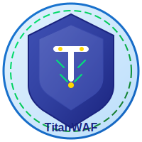

# 🛡️ TitanWAF - Advanced Web Application Firewall

<div align="center">
  
  
  
  
  
  
  
  
</div>

**TitanWAF** is a powerful, intelligent Web Application Firewall designed to protect web applications from various cyber threats with advanced machine learning algorithms and real-time monitoring capabilities.

## 🌍 Platform Support

### Supported Operating Systems
| Platform | Minimum Version | Recommended Version | Status |
|----------|----------------|---------------------|--------|
| **Windows** | Windows 10 (1903) | Windows 11 | ✅ Full Support |
| **macOS** | macOS 10.15 (Catalina) | macOS 13+ (Ventura) | ✅ Full Support |
| **Ubuntu** | Ubuntu 18.04 LTS | Ubuntu 22.04 LTS | ✅ Full Support |
| **Debian** | Debian 10 (Buster) | Debian 11+ (Bullseye) | ✅ Full Support |
| **CentOS/RHEL** | CentOS 7 | CentOS 8+ / RHEL 8+ | ✅ Full Support |
| **Fedora** | Fedora 32 | Fedora 36+ | ✅ Full Support |
| **Arch Linux** | Rolling Release | Latest | ✅ Full Support |

### Architecture Support
- **x64 (AMD64)**: Full support
- **ARM64**: Full support (Apple Silicon, Raspberry Pi 4+)
- **x86**: Limited support (legacy systems)

## 📋 System Requirements

### Minimum Requirements
- **CPU**: 2 cores, 2.0 GHz
- **RAM**: 4 GB
- **Storage**: 2 GB free space
- **Node.js**: 18.0.0+
- **npm**: 8.0.0+
- **Internet**: Required for installation

### Recommended Requirements
- **CPU**: 4+ cores, 3.0+ GHz
- **RAM**: 8+ GB
- **Storage**: 5+ GB SSD
- **Node.js**: 20.0.0+ (LTS)
- **npm**: 10.0.0+
- **Internet**: Continuous connection

### Browser Support
| Browser | Minimum Version | Status |
|---------|----------------|--------|
| **Chrome** | 90+ | ✅ Full Support |
| **Firefox** | 88+ | ✅ Full Support |
| **Safari** | 14+ | ✅ Full Support |
| **Edge** | 90+ | ✅ Full Support |
| **Opera** | 76+ | ✅ Full Support |

## 🚀 Quick Installation

### Automatic Installation (Recommended)
```bash
# Clone the repository
git clone https://github.com/yourusername/TitanWAF.git
cd TitanWAF

# Install all dependencies and start with one command
npm run fresh-install
npm run dev
```

### Platform-Specific Installation Instructions

#### Windows
```powershell
# Run PowerShell as Administrator
# Install Node.js (using Chocolatey)
choco install nodejs

# Or download manually
# Download from https://nodejs.org/en/download/

# Clone the project
git clone https://github.com/yourusername/TitanWAF.git
cd TitanWAF
npm run fresh-install
```

#### macOS
```bash
# Install Node.js with Homebrew
brew install node

# Or use Node Version Manager
curl -o- https://raw.githubusercontent.com/nvm-sh/nvm/v0.39.0/install.sh | bash
nvm install 20
nvm use 20

# Clone the project
git clone https://github.com/yourusername/TitanWAF.git
cd TitanWAF
npm run fresh-install
```

#### Ubuntu/Debian
```bash
# Install Node.js 20.x
curl -fsSL https://deb.nodesource.com/setup_20.x | sudo -E bash -
sudo apt-get install -y nodejs

# Install required tools
sudo apt-get install -y git build-essential

# Clone the project
git clone https://github.com/yourusername/TitanWAF.git
cd TitanWAF
npm run fresh-install
```

#### CentOS/RHEL/Fedora
```bash
# Install Node.js (DNF/YUM)
sudo dnf install nodejs npm git
# or
sudo yum install nodejs npm git

# Clone the project
git clone https://github.com/yourusername/TitanWAF.git
cd TitanWAF
npm run fresh-install
```

## 🐳 Docker Installation

### Docker Compose (Recommended)
```yaml
# docker-compose.yml
version: '3.8'
services:
  titanwaf-backend:
    build: ./waf-tool/backend
    ports:
      - "3003:3003"
    environment:
      - NODE_ENV=production
    volumes:
      - ./logs:/app/logs
      - ./config:/app/config

  titanwaf-frontend:
    build: ./waf-tool/frontend
    ports:
      - "3000:3000"
    depends_on:
      - titanwaf-backend
```

```bash
# Run with Docker
docker-compose up -d
```

### Manual Docker Installation
```bash
# Backend
cd waf-tool/backend
docker build -t titanwaf-backend .
docker run -d -p 3003:3003 titanwaf-backend

# Frontend
cd ../frontend
docker build -t titanwaf-frontend .
docker run -d -p 3000:3000 titanwaf-frontend
```

## ⚙️ Configuration

### Environment Variables
```bash
# Backend (.env)
PORT=3003
NODE_ENV=production
LOG_LEVEL=info
RATE_LIMIT_WINDOW=60000
MAX_REQUESTS_PER_WINDOW=100
BLOCK_DURATION=300000
WHITELIST_AUTO_ADD=true

# Frontend (.env)
REACT_APP_API_URL=http://localhost:3003
REACT_APP_WEBSOCKET_URL=ws://localhost:3003
REACT_APP_LANGUAGE=en
```

### Security Configuration
```typescript
// waf-tool/backend/src/config/security.ts
export const SECURITY_CONFIG = {
  ADAPTIVE_THRESHOLDS: {
    SQL_INJECTION: { base: 5, min: 2, max: 10 },
    XSS: { base: 3, min: 1, max: 8 },
    COMMAND_INJECTION: { base: 2, min: 1, max: 5 },
    FILE_INCLUSION: { base: 2, min: 1, max: 5 }
  },
  RATE_LIMITING: {
    WINDOW_MS: 60000,
    MAX_REQUESTS: 100,
    BLOCK_DURATION: 300000
  }
};
```

## 🔧 Advanced Installation Options

### Production Environment Setup
```bash
# Optimized installation for production
NODE_ENV=production npm run install-all
npm run build
npm start
```

### Development Environment Setup
```bash
# Installation with development tools
npm run install-all
npm run dev
```

### Cluster Installation
```bash
# Cluster setup with PM2
npm install -g pm2
pm2 start ecosystem.config.js
```

## 📊 Performance and Scaling

### Performance Metrics
- **Request Processing**: 10,000+ requests/second
- **Memory Usage**: ~200MB (baseline)
- **CPU Usage**: 5-15% (normal load)
- **Response Time**: <10ms (average)

### Scaling Options
- **Horizontal Scaling**: Multiple instances with load balancer
- **Vertical Scaling**: More powerful hardware
- **Microservice Architecture**: Deploy components separately

## 🛡️ Security Features

### Attack Detection Types
- **SQL Injection**: Union, Boolean, Time-based, Error-based
- **Cross-Site Scripting (XSS)**: Reflected, Stored, DOM-based
- **Command Injection**: System commands, Shell metacharacters
- **File Inclusion**: LFI, RFI, Directory traversal
- **DDoS Protection**: Rate limiting, IP reputation
- **Bot Protection**: User-Agent analysis, Behavior analysis

### Intelligent Protection Systems
- **Adaptive Thresholds**: Dynamic thresholds based on IP reputation
- **Auto Whitelist**: Automatic addition of trusted IPs
- **Machine Learning**: Learning attack patterns
- **Real-time Analysis**: Instant threat assessment

## 📈 Monitoring and Reporting

### Real-time Dashboard
- **Live Attack Counter**: Instant attack statistics
- **IP Reputation Tracking**: Visual reputation scores
- **Attack Type Distribution**: Pie charts and graphs
- **Geographic Attack Mapping**: Attack source visualization
- **Historical Trends**: Attack pattern analysis

### Logging System
- **Structured Logging**: JSON-formatted logs
- **Severity Classification**: 1-10 severity scoring
- **Real-time Updates**: WebSocket-powered live logs
- **Export Capabilities**: CSV/JSON log export

## 🌐 Multi-Language Support

TitanWAF supports the following languages:
- **English** (Default)
- **Turkish** (Türkçe)
- **Spanish** (Español) - Coming Soon
- **French** (Français) - Coming Soon
- **German** (Deutsch) - Coming Soon

## 🔄 Updates and Maintenance

### Automatic Updates
```bash
# Check for updates
npm run check-updates

# Apply updates
npm run update
```

### Manual Update
```bash
# Pull latest changes
git pull origin main

# Update dependencies
npm run fresh-install

# Restart services
npm run dev
```

## 🆘 Troubleshooting

### Common Issues and Solutions

#### Port Already in Use Error
```bash
# Windows
netstat -ano | findstr :3000
taskkill /PID <PID> /F

# Linux/macOS
lsof -ti:3000 | xargs kill -9
```

#### Dependency Installation Errors
```bash
# Clear cache
npm cache clean --force

# Remove node modules and reinstall
rm -rf node_modules package-lock.json
npm install
```

#### Memory Insufficient
```bash
# Increase Node.js memory limit
export NODE_OPTIONS="--max-old-space-size=4096"
npm run dev
```

## 📞 Support and Contact

### Technical Support
- **GitHub Issues**: [Issues page](https://github.com/yourusername/TitanWAF/issues)
- **Documentation**: [Wiki page](https://github.com/yourusername/TitanWAF/wiki)
- **Email**: support@titanwaf.com

### Community
- **Discord**: [TitanWAF Community](https://discord.gg/titanwaf)
- **Telegram**: [@TitanWAF](https://t.me/titanwaf)
- **Reddit**: [r/TitanWAF](https://reddit.com/r/titanwaf)

## 🤝 Contributing

1. Fork the project
2. Create your feature branch (`git checkout -b feature/AmazingFeature`)
3. Commit your changes (`git commit -m 'Add some AmazingFeature'`)
4. Push to the branch (`git push origin feature/AmazingFeature`)
5. Create a Pull Request

## 📄 License

This project is licensed under the MIT License - see the [LICENSE](LICENSE) file for details.

## 🙏 Acknowledgments

- Material-UI for beautiful React components
- Socket.IO for real-time communication
- Express.js for robust backend framework
- TypeScript for type safety and better development experience

---

**Made with ❤️ by TitanWAF Team**

*Protecting web applications, one request at a time.* 